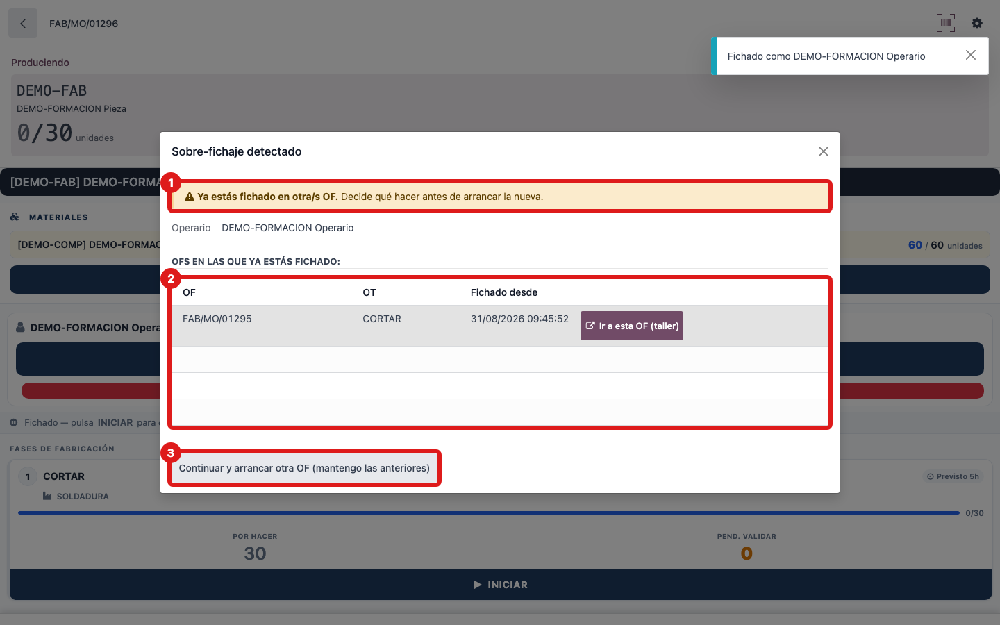

## Cuándo se usa
Cuando arrancas una segunda OF mientras todavía tienes otra abierta (fichado en ella). La tablet te avisa para que confirmes que quieres tener las dos a la vez.

## Antes de empezar
Estar identificado y tener ya una OF con fichaje abierto. Vas a arrancar una OF distinta desde su tablet o escaneando su código.

## Pasos
1. Inicia o escanea la nueva OF como siempre.
2. Cuando salga la ventana **Sobre-fichaje detectado**, mira la lista **OFs en las que ya estás fichado** para comprobar que es correcto.
   
3. Pulsa **Continuar y arrancar otra OF (mantengo las anteriores)**. Quedarás fichado en las dos.

## Si algo va mal
- Si en realidad querías **cerrar** la OF anterior antes de arrancar esta, cancela la ventana, vuelve a la OF de antes y desfíchate con **PAUSAR** (registrando las piezas).
- Si dudas de si de verdad tenías esa OF abierta, usa el botón **Ir a esta OF (taller)** de la lista para revisarla.
- Tranquilo con las horas: tu **presencia** (el tiempo en fábrica) **no se duplica** aunque estés fichado en dos OFs; se calcula de tu entrada y salida reales, no sumando fichajes. El aviso es solo para que lo confirmes.

## Escalar
Si el aviso te sale y crees que no tenías ninguna OF abierta, avisa a tu responsable: puede haber quedado un fichaje sin cerrar de antes. Dile tu nombre y qué OFs aparecen en la lista.
