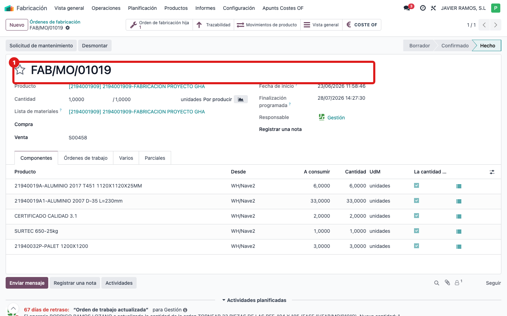
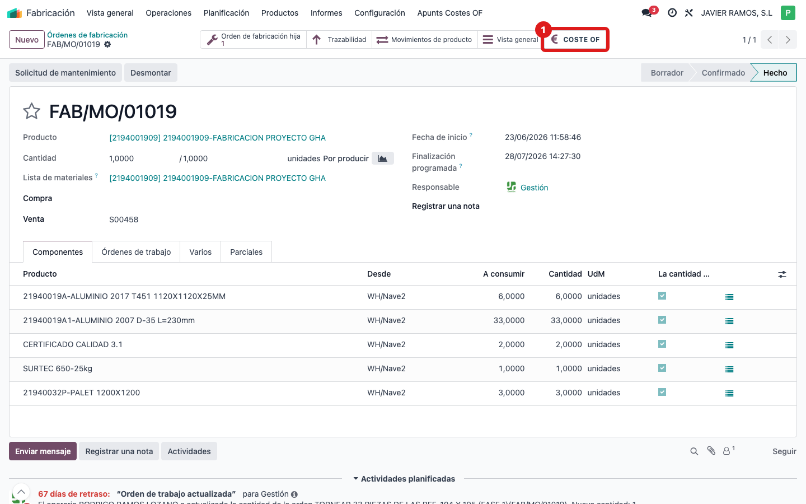
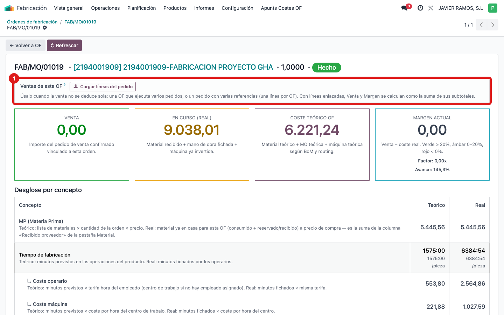
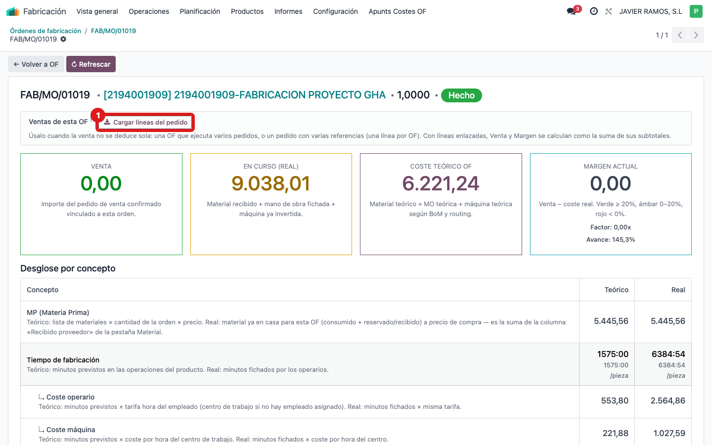
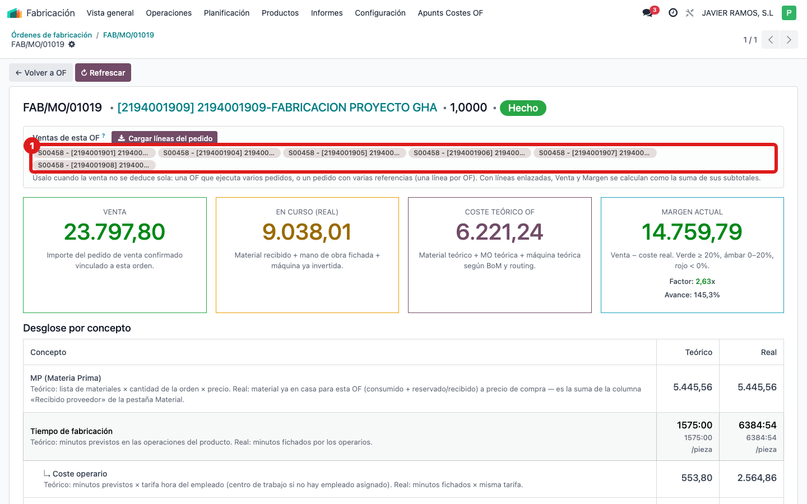
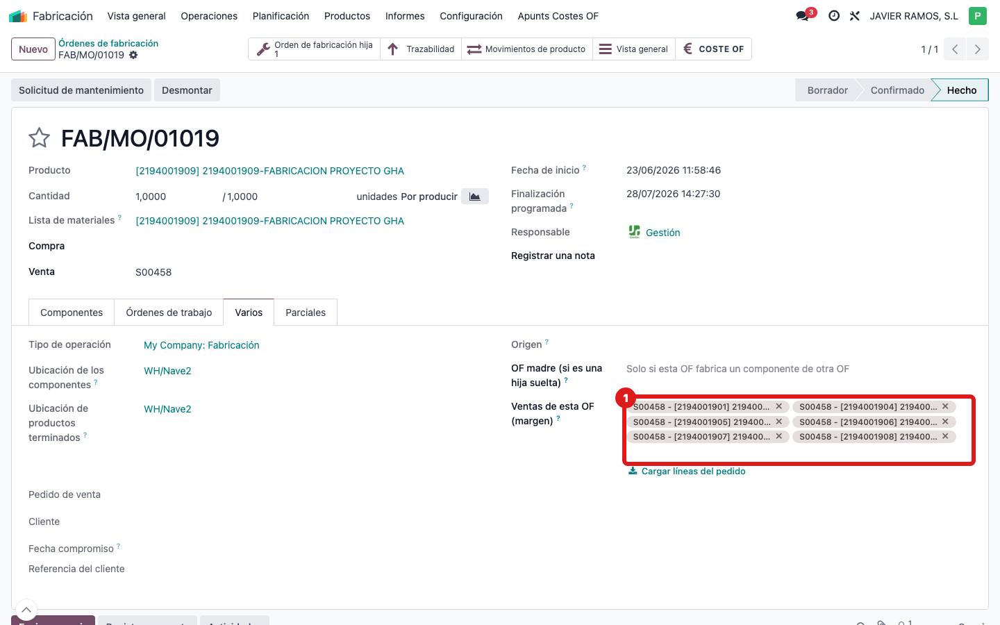
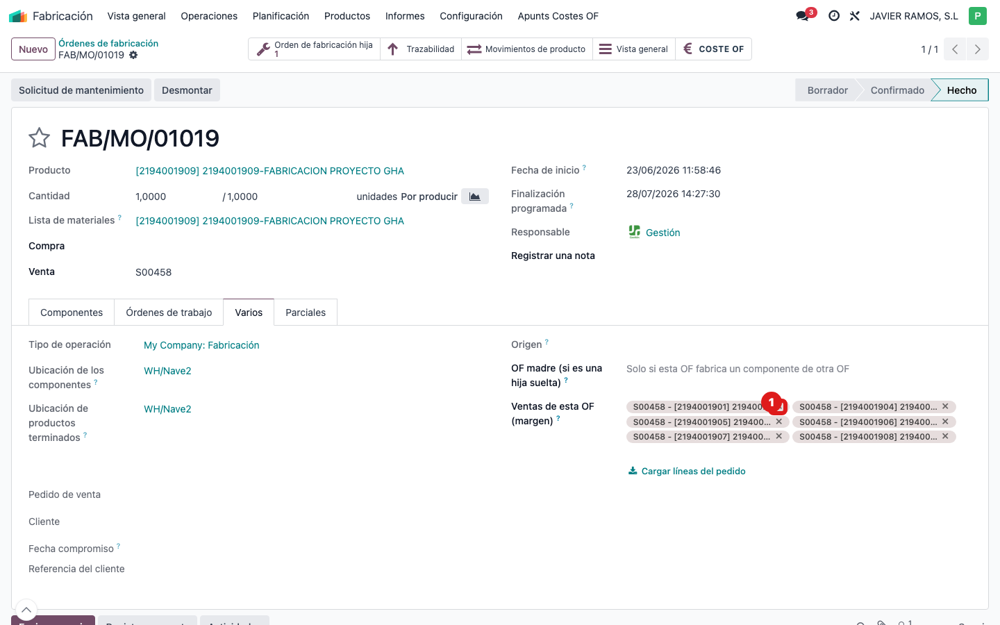
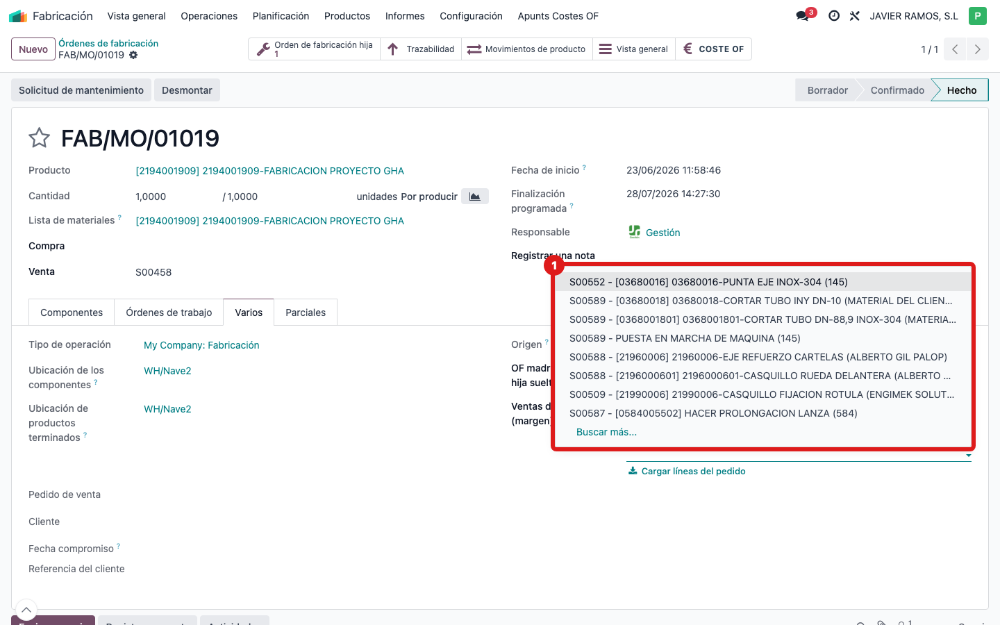
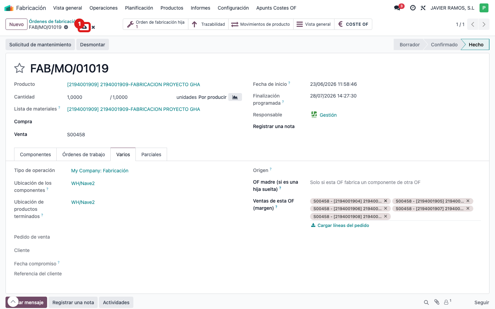

## Cuándo se usa
Cuando el **margen** de una orden de fabricación (OF) sale **raro**: a **0 €** aunque el trabajo se
vende, o **disparado** (mucho más de lo que se cobra). El sistema intenta adivinar la venta de la
OF buscando su producto en el pedido; cuando no lo encuentra o lo cuenta de más, hay que
**indicarle a mano de qué línea(s) del pedido sale la venta**. Esto se hace en un clic con el botón
**"Cargar líneas del pedido"**, y a partir de ahí el margen cuadra solo.

Es rápido: normalmente es **abrir la OF → un botón → comprobar → guardar**.

## Antes de empezar
- Ten claro **qué pedido de venta** corresponde a esta OF (número S000xx) y, si la OF junta varios
  pedidos, cuáles.
- Regla de oro: **si el margen de la OF ya sale bien, NO toques nada.** Esto solo es para las OF
  cuyo margen sale mal (a 0 o disparado).

## Pasos
1. Entra en **Fabricación → Órdenes de fabricación** y abre la OF cuyo margen quieres revisar.
   
2. Pulsa el smart button **COSTE OF** (icono €, arriba a la derecha). Se abre la pantalla de coste.
   
3. Mira la tarjeta **Margen actual**. Si ves un **0 €** o un número que no cuadra con lo que se
   cobra, es que la venta no se está cogiendo bien: sigue con los pasos.
   
4. Arriba del todo, localiza el recuadro **"Ventas de esta OF (para el margen)"**. Si está vacío,
   la venta se está calculando en automático (y por eso puede fallar).
   
5. Pulsa el botón **"Cargar líneas del pedido"**.
   
6. Aparecen, como etiquetas, la(s) **línea(s) del pedido** de esta OF (por ejemplo `S00458 -
   [ref] Producto`). El botón es **listo**: si el producto que fabrica la OF está como línea del
   pedido, trae **solo esa línea**; si no está (proyecto vendido por partes), trae **todas** las
   del pedido.
   
7. Vuelve a mirar las tarjetas **Venta** y **Margen actual**: ahora deben **cuadrar** con lo que de
   verdad se factura.
   
8. **Para quitar o añadir líneas a mano**, ve a la OF → pestaña **Varios**: verás el **mismo
   campo** «Ventas de esta OF (margen)». (En el panel COSTE OF ese campo es de **solo lectura**;
   ahí solo funciona el botón. La edición a mano se hace aquí, en Varios.)
   
9. **Si sobra alguna línea** (una que no es de esta OF), quítala pulsando la **✕** de su etiqueta.
   La venta y el margen se recalculan al instante.
   
10. **Si esta OF ejecuta VARIOS pedidos a la vez**, el botón solo trae las del pedido principal:
    añade las líneas del **otro pedido** a mano escribiendo en el desplegable y eligiéndolas.
    
11. **Guarda** la OF. El margen ya queda fijado a esas líneas.
    
12. **En una frase:** le has dicho a la OF *"tu venta es esta/estas línea(s) del pedido"*. Mientras
    ese campo tenga líneas, la Venta y el Margen se calculan sumando sus subtotales; si lo dejas
    **vacío**, vuelve al cálculo automático de siempre.

## Si algo va mal
- **El botón cargó de más** (la venta se disparó): es un pedido con varias referencias y el botón
  trajo alguna que no toca. Quita con la **✕** las líneas que no sean de esta OF hasta que el
  margen cuadre.
- **No pasa nada al pulsar el botón:** puede que la OF no tenga pedido de venta vinculado. En ese
  caso escribe las líneas a mano en el campo, o revisa que la OF esté enlazada a su pedido.
- **Quiero volver al cálculo automático:** vacía el campo "Ventas de esta OF" (quita todas las
  etiquetas) y guarda.
- **No toques OF que ya valoran bien:** si el margen ya era correcto, pulsar el botón puede
  cambiarlo; solo úsalo en las que salen mal.

## Escalar
Si tras cargar/ajustar las líneas el margen sigue sin cuadrar con lo que se factura, avisa a Apunts
con el número de la OF, el/los pedido(s) de venta y una captura de las tarjetas Venta y Margen.
