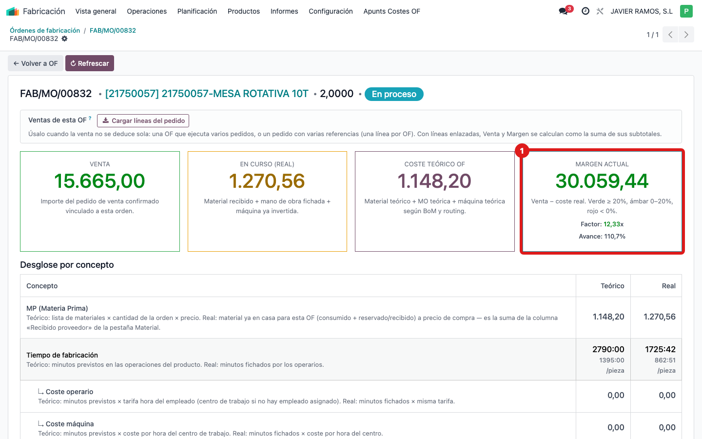
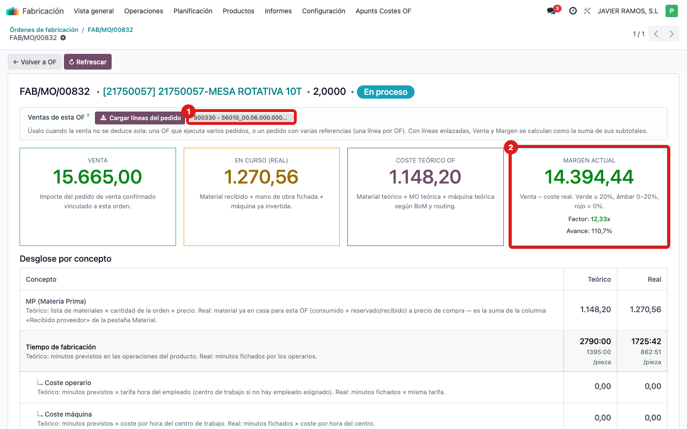
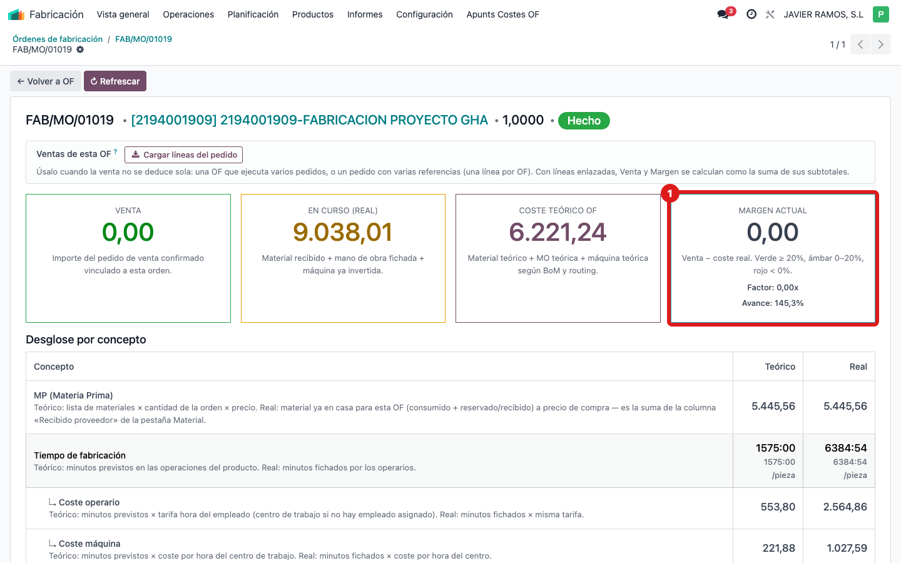
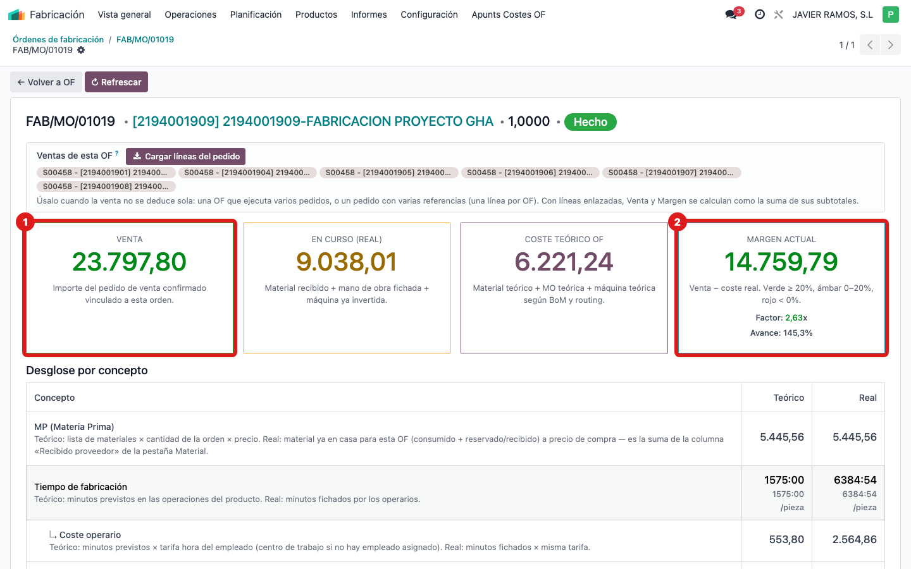
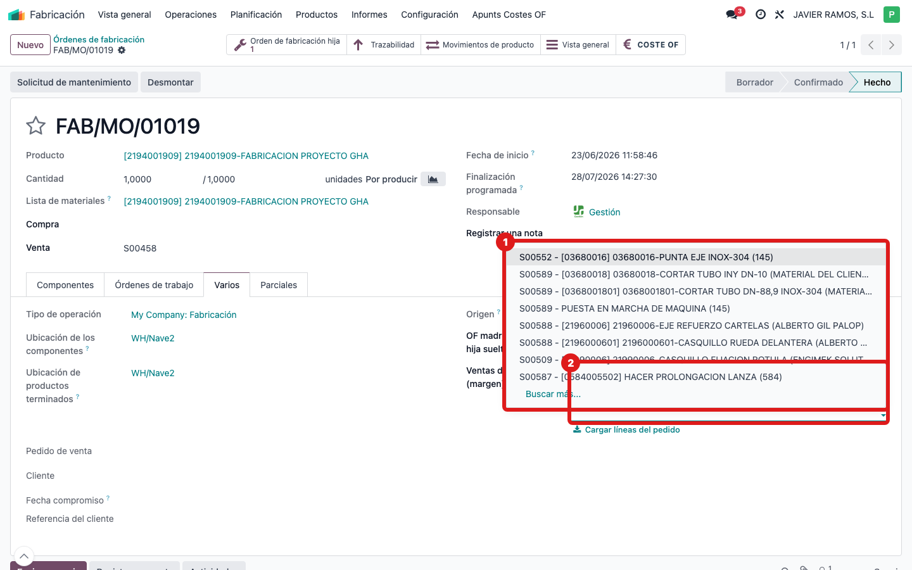

## Cuándo se usa
Para reconocer **por qué** el margen de una OF sale mal y saber **cuál de los tres casos** tienes
delante. En los tres, la solución es la misma —indicarle la venta con las líneas del pedido (ver la
guía «Poner la venta de una OF con las líneas del pedido»)—, pero conviene entender cada uno.

## Antes de empezar
- Ten a mano la OF y su pedido de venta. El margen se ve en el smart button **COSTE OF** de la OF.

## Pasos
1. **CASO A — La OF fabrica MÁS unidades de las que hay en el pedido.**
   Ejemplo real: la OF **FAB/MO/00832** (mesa rotativa) fabrica **2 unidades**, pero el pedido
   **S00330** solo vende **1** a 15.665 €. El sistema multiplicaba lo fabricado por el precio y el
   margen salía **disparado (~30.000 €)**.
   
2. **Cómo queda tras indicarle la venta:** enlazas **esa 1 línea** del pedido → la venta pasa a ser
   **15.665 €** y el margen queda en **~14.394 €**, lo correcto.
   
3. **CASO B — El producto que fabrica la OF NO está como línea del pedido** (proyecto vendido por
   partes). Ejemplo real: la OF **FAB/MO/01019** fabrica «PROYECTO GHA», pero el pedido **S00458**
   vende las **6 piezas por separado**. Como no encuentra el producto en el pedido, el margen salía
   **a 0 €**.
   
4. **Cómo queda:** pulsas **"Cargar líneas del pedido"** → como el producto no está, trae **las 6
   líneas** → la venta pasa a **23.797,80 €** y el margen a **~14.759 €**.
   
5. **CASO C — Una OF que ejecuta VARIOS pedidos a la vez.**
   El botón «Cargar líneas del pedido» solo trae las del pedido principal. Para el resto, añade a
   mano las líneas del **otro pedido** escribiéndolas en el campo «Ventas de esta OF». La venta
   final es la **suma** de todas las líneas enlazadas (de los dos pedidos).
   
6. **Regla común a los tres:** con líneas enlazadas, **Venta = suma de sus subtotales** y
   **Margen = Venta − coste real**. Si el campo se deja **vacío**, la OF vuelve al cálculo
   automático (que es el que fallaba en estos tres casos).

## Si algo va mal
- **No sabes de qué caso es:** míralo por el síntoma — margen **disparado** = Caso A (fabrica de
  más); margen **a 0** con venta real = Caso B (producto no está en el pedido); una OF que junta
  **dos pedidos** = Caso C.
- **La mayoría de OF NO son ninguno de estos casos** y su margen ya sale bien: en esas, no hay que
  tocar nada.

## Escalar
Si crees que una OF encaja en un caso distinto o el margen sigue sin cuadrar tras enlazar las
líneas, avisa a Apunts con la OF, el/los pedido(s) y una captura del margen.
